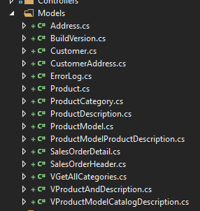
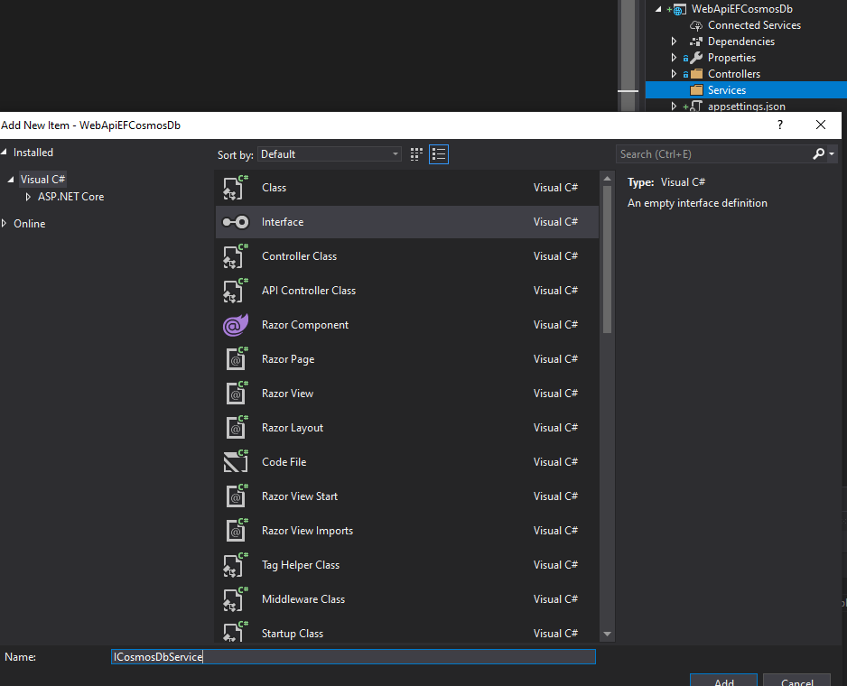
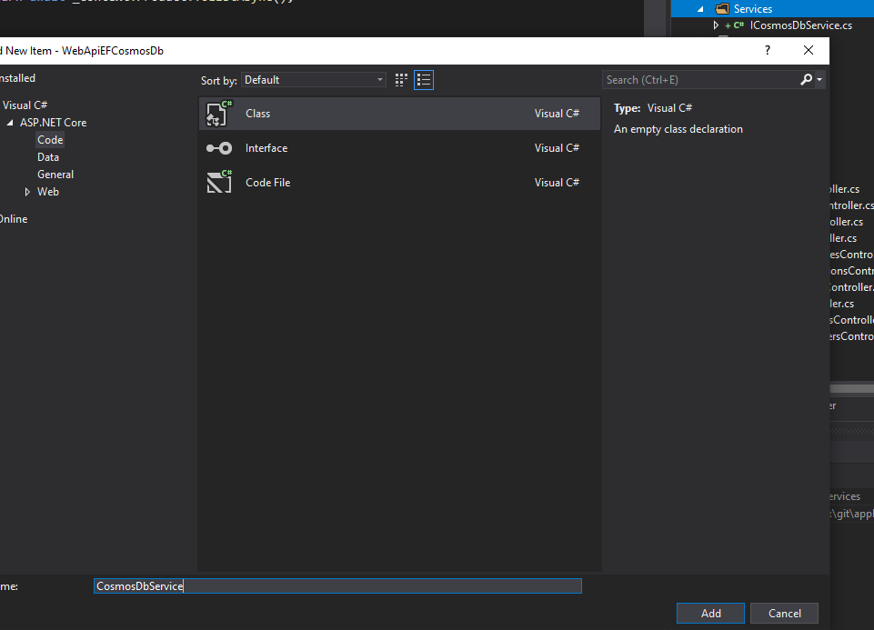
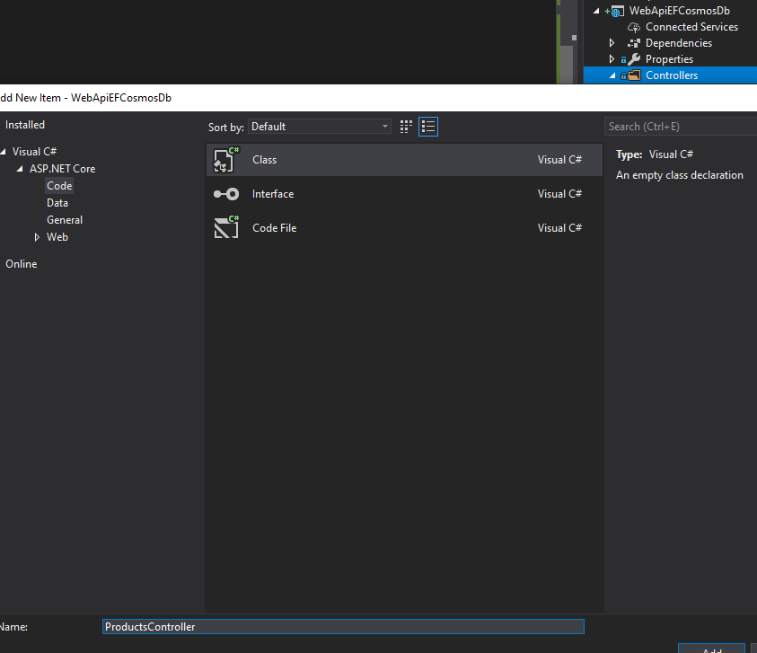

# ASP.NET Core WebApi and CosmosDB

>NOTE: Please first ensure you have completed [ASP.NET Core3 WebApi with SQL Server and EntityFramework](ASP.NET%20netCore%203.0%20WebApi%20SQL%20Server%20and%20EntityFramework.md)

# nuget

- Microsoft.EntityFrameworkCore.Cosmos
- Newtonsoft.json

# Add key in appsettings.json

```json
  "CosmosDb": {
    "Endpoint": "<URI IN THE KEYS SECTION>",
    "Key": "<PRIMARY OR SECONDARY KEY IN THE KEYS SECTION>",
    "DatabaseName": "<NAME OF THE DATABASE>",
    "ContainerName": "<NAME OF THE CONTAINER>"
  },
```

# Create Model

We are going to use the classes from the previous demos

1. Create "Models" folder
2. Copy-Paste the Model classes created before 



3. Edit the files and update the namespace acordingly. In this case:

```csharp
namespace WebApiEFCosmosDb.Models
```


# Create DbContext

1. Create new folder named "Services"

1. Create a new interface for the cosmosdb context



1. Add the following methods to the interface

```csharp
    public interface ICosmosDbService
    {
        Task<IActionResult> PutProduct(int id, Product product);
        Task<ActionResult<Product>> DeleteProduct(int id);
        bool ProductExists(int id);
        Task<ActionResult<Product>> GetProduct(int id);
        Task<ActionResult<IEnumerable<Product>>> GetProduct();
    }
```

1. Add the CosmosDbService



## Initialize methods

Go to Startup.cs and Add the cosmos initialization method

```csharp
/// <summary>
/// Creates a Cosmos DB database and a container with the specified partition key. 
/// </summary>
/// <returns></returns>
private static async Task<CosmosDbService> InitializeCosmosClientInstanceAsync(IConfigurationSection configurationSection)
{
    string databaseName = configurationSection.GetSection("DatabaseName").Value;
    string containerName = configurationSection.GetSection("ContainerName").Value;
    string account = configurationSection.GetSection("Endpoint").Value;
    string key = configurationSection.GetSection("Key").Value;
    CosmosClientBuilder clientBuilder = new CosmosClientBuilder(account, key);
    CosmosClient client = clientBuilder
                        .WithConnectionModeDirect()
                        .Build();
    CosmosDbService cosmosDbService = new CosmosDbService(client, databaseName, containerName);
    DatabaseResponse database = await client.CreateDatabaseIfNotExistsAsync(databaseName);
    await database.Database.CreateContainerIfNotExistsAsync(containerName, "/ProductId");
    return cosmosDbService;
}
```

And also the following line in the ConfigureServices method

```csharp
public void ConfigureServices(IServiceCollection services)
        {
            services.AddControllers();
            services.AddSingleton<ICosmosDbService>(InitializeCosmosClientInstanceAsync(Configuration.GetSection("CosmosDb")).GetAwaiter().GetResult());
        }
```

>Now, EFCore is linked to cosmosdb. The rest is to create the controllers

# Add the ProductController class

Now it´s time to create our controller. We need to do it manually, since EFCore at the time of writing this demo does not automatically generates the CRUD for us.




