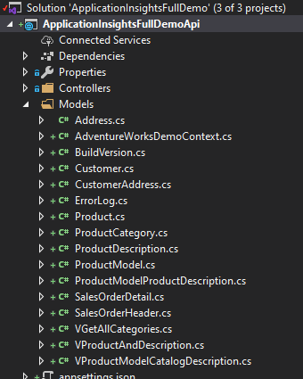
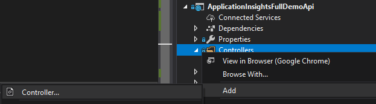
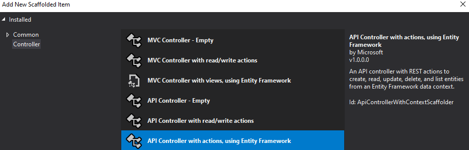
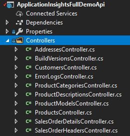

# Full demo of application insights

First of all, [deploy the infrastructure required for the demos](./DeployIInfrastructure.ipynb)

## Install EntityFramework

Install nuget packages:

- Microsoft.Entity.Framework.SqlServer
- Microsoft.EntityFrameworkCore.Tools
- Microsoft.EntityFrameworkCore.Design
- AutoMapper
- AutoMapper.Extensions.Microsoft.DependencyInjection
- Newtonsoft.Json

This is what you should have


## Generate CRUD

> NOTE: Please, use the database created in the [DeployInfrastructure.ipynb](./DeployIInfrastructure.ipynb) 

Open Package manage console


And execute the following code

```powershell
Scaffold-DbContext "Server=your server;Database=YourDatabase;User ID=YourUser;Password=YourPassword" Microsoft.EntityFrameworkCore.SqlServer -OutputDir Models
```

for example:
```powershell
Scaffold-DbContext "Server=mslearn-appinsights-sqlserver.database.windows.net;Database=AdventureWorksDemo;User ID=administrador;Password=PaSSw0rdñ." Microsoft.EntityFrameworkCore.SqlServer -OutputDir Models
```

>NOTE: Make sure you are in the folder of the **ApplicationInsightsDemoApi**


And after a couple of seconds



### Configure DbContext

AdventureWorksDemoContext.cs contains our DbContext WITH THE CONNECTION STRING PLAIN TEXT IN THE CODE


Let´s **delete** that method and write to the appsettings.json the following

```json
"ConnectionStrings": {
    "SQLServerDbContext": "Server=mslearn-appinsights-sqlserver.database.windows.net;Database=AdventureWorksDemo;User ID=administrador;Password=PaSSw0rdñ."
  },
```

### Add a new folder "DTOs"


### Add all DTOs (Data Transfer Objects)

Add new class for each Model and change the ICollection to List

For example:

```csharp
    public partial class AddressDTO
    {
        public AddressDTO()
        {
            CustomerAddress = new List<CustomerAddressDTO>();
            SalesOrderHeaderBillToAddress = new List<SalesOrderHeaderDTO>();
            SalesOrderHeaderShipToAddress = new List<SalesOrderHeaderDTO>();
        }

        public int AddressId { get; set; }
        public string AddressLine1 { get; set; }
        public string AddressLine2 { get; set; }
        public string City { get; set; }
        public string StateProvince { get; set; }
        public string CountryRegion { get; set; }
        public string PostalCode { get; set; }
        public Guid Rowguid { get; set; }
        public DateTime ModifiedDate { get; set; }

        public virtual List<CustomerAddressDTO> CustomerAddress { get; set; }
        public virtual List<SalesOrderHeaderDTO> SalesOrderHeaderBillToAddress { get; set; }
        public virtual List<SalesOrderHeaderDTO> SalesOrderHeaderShipToAddress { get; set; }
    }
```

### Configure AutoMapper

AutoMapperConfiguration will be responsible for mapping DTOs to controllers

```csharp
    public class AutoMapperConfiguration: Profile
    {
        public AutoMapperConfiguration()
        {

            // To avoid circular references, i´m ignoring navegation contexts
            CreateMap<Address, AddressDTO>()
                   .ForMember(x => x.CustomerAddress, o => o.Ignore())
                   .ForMember(x => x.SalesOrderHeaderBillToAddress, o => o.Ignore())
                   .ForMember(x => x.SalesOrderHeaderShipToAddress, o => o.Ignore())
                   .ReverseMap();

            CreateMap<BuildVersion,BuildVersionDTO>().ReverseMap();
            CreateMap<CustomerAddress, CustomerAddressDTO>().ReverseMap();
            CreateMap<Customer, CustomerDTO>()
                .ForMember(x => x.CustomerAddress, o => o.Ignore())
                .ForMember(x => x.SalesOrderHeader, o => o.Ignore())
                .ReverseMap();
            CreateMap<ErrorLog, ErrorLogDTO>().ReverseMap();
            CreateMap<ProductCategory, ProductCategoryDTO>()
                .ForMember(x => x.ParentProductCategory, o => o.Ignore())
                .ForMember(x => x.InverseParentProductCategory, o => o.Ignore())
                .ForMember(x => x.Product, o => o.Ignore())
                .ReverseMap();
            CreateMap<ProductDescription, ProductDescriptionDTO>()
                .ForMember(x => x.ProductModelProductDescription, o => o.Ignore())
                .ReverseMap();
            CreateMap<Product, ProductDTO>()
                .ForMember(x => x.ProductCategory, o => o.Ignore())
                .ForMember(x => x.ProductModel, o => o.Ignore())
                .ForMember(x => x.SalesOrderDetail, o => o.Ignore())
                .ReverseMap();
            CreateMap<ProductModel, ProductModelDTO>()
                .ForMember(x => x.Product, o => o.Ignore())
                .ForMember(x => x.ProductModelProductDescription, o => o.Ignore())
                .ReverseMap();
            CreateMap<ProductModelProductDescription, ProductModelProductDescriptionDTO>().ReverseMap();
            CreateMap<SalesOrderDetail, SalesOrderDetailDTO>().ReverseMap();
            CreateMap<SalesOrderHeader, SalesOrderHeaderDTO>()
                .ForMember(x => x.SalesOrderDetail, o => o.Ignore())
                .ReverseMap();
            CreateMap<VGetAllCategories, VGetAllCategoriesDTO>().ReverseMap();
            CreateMap<VProductAndDescription, VProductAndDescriptionDTO>().ReverseMap();
            CreateMap<VProductModelCatalogDescription, VProductModelCatalogDescriptionDTO>().ReverseMap();

        }
    }
```

## Startup.cs

Include AutoMapper configuration by adding this line to ConfigureServices(IServiceCollection services)

```csharp
   public void ConfigureServices(IServiceCollection services)
        {
            services.AddControllers();
            services.AddAutoMapper(typeof(Startup));
            services.AddDbContext<AdventureWorksDemoContext>(options => options.UseSqlServer(Configuration.GetConnectionString("SQLServerDbContext")));
        }     
```

## Add the controllers

One per Model 






Y finalmente quedará así:



## Appsettings.json

Make appsettings.json as "copy always"