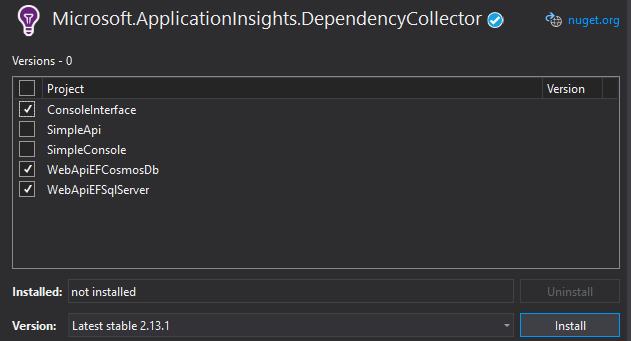
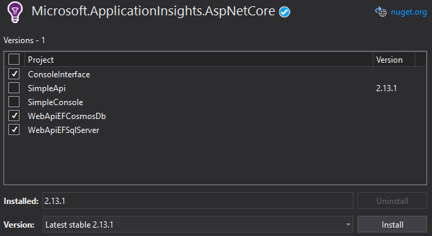

# Add application insights to our tool

This demo requires that you completed successfuly the demos:
- [ASP.NET netCore 3.0 WebApi SQL Server and EntityFramework](ASP.NET%20netCore%203.0%20WebApi%20SQL%20Server%20and%20EntityFramework.md)
- [ASP.NET netCore 3.0 WebApi CosmosDB](ASP.NET%20netCore%203.0%20WebApi%20SQL%20Server%20and%20EntityFramework.md)
- [ConsoleApp](ConsoleApp.md)


## Adding Application insights packages

Add the following packages to our solutions
- Microsoft.ApplicationInsights
- Microsoft.ApplicationInsights.AspNetCore
- Microsoft.ApplicationInsights.DependencyCollector 






## Configure Application Insights

## Add application insights key

Edit the appsettings.json and include a tag for the ApplicationInsights 

>NOTE: Write your own KEY

```json
{
  "ConnectionStrings": {
    "SQLServerDbContext": "<YOUR SQL CONNECTION STRING>"
  },
  "ApplicationInsights": {
    "InstrumentationKey": "<YOUR KEY>"
  },
  "Logging": {
    "LogLevel": {
      "Default": "Information",
      "Microsoft": "Warning",
      "Microsoft.Hosting.Lifetime": "Information"
    }
  },
  "AllowedHosts": "*"
}
```

>**IMPORTANT:** Repeat the process in the appsettings.json of the CosmosDB webapi, sqlserver webapi and consoleinterface.

## Initialize application insights in WebApi

Go to "_Startup.cs_", locate the method _public void ConfigureServices(IServiceCollection services)_ and add the following line at the end

```csharp
// The following line enables Application Insights telemetry collection.
services.AddApplicationInsightsTelemetry(); 
#if DEBUG
            // Telemetry results exposed inmediately 
            // Switch it off in production, because it may slow down your app.
            TelemetryConfiguration.Active.TelemetryChannel.DeveloperMode = true;
#endif
```

## Initialize application insights in your console application

Go to _Program.cs_ and add the following line in the _Main_ method

```csharp
TelemetryConfiguration.Active.InstrumentationKey = configuration.GetSection("ApplicationInsights:InstrumentationKey").Value;
#if DEBUG
            // Telemetry results exposed inmediately 
            // Switch it off in production, because it may slow down your app.
            TelemetryConfiguration.Active.TelemetryChannel.DeveloperMode = true;
#endif
```


