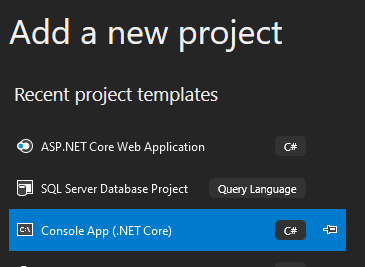
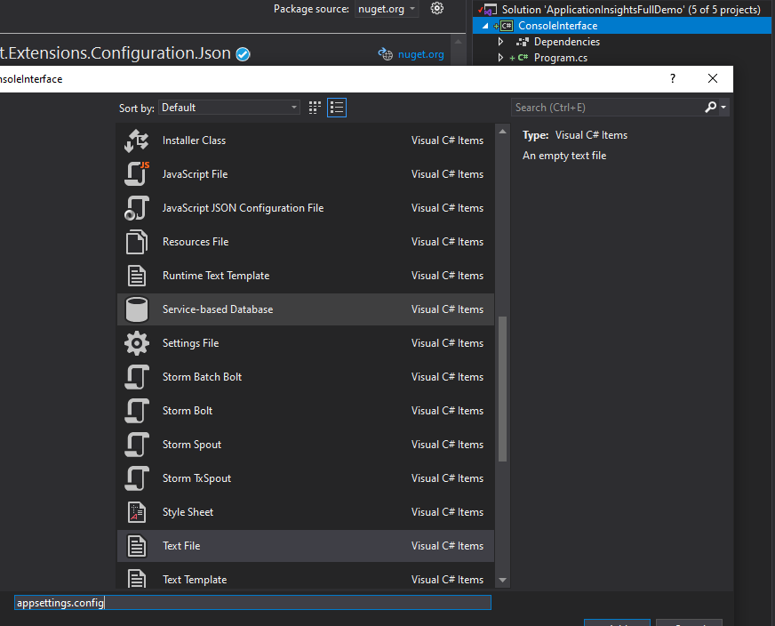

# Console app for testing

>NOTE: Please first ensure you have completed [ASP.NET Core WebApi and CosmosDB](/Labs/ASP.NET%20netCore%203.0%20WebApi%20CosmosDB.md)

# nuget

- Microsoft.AspNet.WebApi.Client
- Newtonsoft.json
- Microsoft.Extensions.Configuration
- Microsoft.Extensions.Configuration.FileExtensions
- Microsoft.Extensions.Configuration.Json

# Create the console application

Put the name "ConsoleInterface"

## Add appsettings.config

Must be done manually

