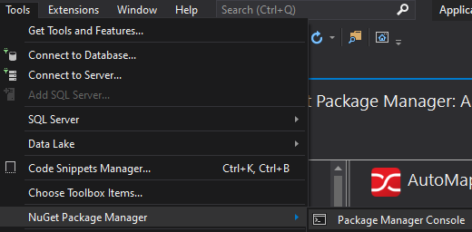
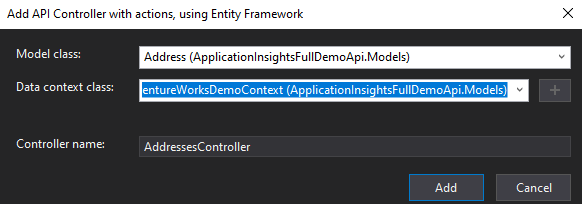
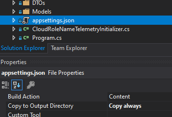
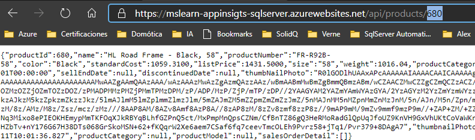

# Create WebApi based on netCore 3 with SQL Server and Entity Framework Core

First of all, [deploy the infrastructure required for the demos](Lab2%20-%20Create%20infrastructure.ipynb)

## Create a project named WebApiEFSqlServer

Use an ASP.NET Core Web Application with C#


> NOTE: You can create an empty solution and include this Project


## Install nuget packages

Install nuget packages:

- Microsoft.Entity.Framework.SqlServer
- Microsoft.EntityFrameworkCore.Tools
- Microsoft.EntityFrameworkCore.Design
- AutoMapper
- AutoMapper.Extensions.Microsoft.DependencyInjection
- Newtonsoft.Json

This is what you should have at this point


## Generate CRUD

> NOTE: Please, use the database created in the [Lab2](Lab2%20-%20Create%20infrastructure.ipynb) 

Open Package manage console



And execute the following code

```powershell
Scaffold-DbContext "Server=your server;Database=YourDatabase;User ID=YourUser;Password=YourPassword" Microsoft.EntityFrameworkCore.SqlServer -OutputDir Models
```

for example:
```powershell
Scaffold-DbContext "Server=mslearn-appinsights-sqlserver.database.windows.net;Database=AdventureWorksDemo;User ID=administrador;Password=PaSSw0rdñ." Microsoft.EntityFrameworkCore.SqlServer -OutputDir Models
```

>NOTE: Make sure you are in the folder of the **ApplicationInsightsDemoApi**


And after a couple of seconds


### Configure DbContext

AdventureWorksDemoContext.cs contains our DbContext _**WITH THE CONNECTION STRING PLAIN TEXT IN THE CODE**_


Let´s **delete** that method and write to the appsettings.json the following

```json
"ConnectionStrings": {
    "SQLServerDbContext": "Server=mslearn-appinsights-sqlserver.database.windows.net;Database=AdventureWorksDemo;User ID=administrador;Password=PaSSw0rdñ."
  },
```

## Add Data Transfer Objects (DTOs)

We must create DTOs for each class. At this point, is something we need to do manually

## Add a new folder "DTOs"


### Add all DTOs 

Add new class for each Model and change the ICollection to List (manually).
It´s very easy. You only need to copy-paste the files to the folder DTO and use a Replace method from visual studio to update:
- ICollection to List
- Namespace to include the _.DTO_

For example:

```csharp
    public partial class AddressDTO
    {
        public AddressDTO()
        {
            CustomerAddress = new List<CustomerAddressDTO>();
            SalesOrderHeaderBillToAddress = new List<SalesOrderHeaderDTO>();
            SalesOrderHeaderShipToAddress = new List<SalesOrderHeaderDTO>();
        }

        public int AddressId { get; set; }
        public string AddressLine1 { get; set; }
        public string AddressLine2 { get; set; }
        public string City { get; set; }
        public string StateProvince { get; set; }
        public string CountryRegion { get; set; }
        public string PostalCode { get; set; }
        public Guid Rowguid { get; set; }
        public DateTime ModifiedDate { get; set; }

        public virtual List<CustomerAddressDTO> CustomerAddress { get; set; }
        public virtual List<SalesOrderHeaderDTO> SalesOrderHeaderBillToAddress { get; set; }
        public virtual List<SalesOrderHeaderDTO> SalesOrderHeaderShipToAddress { get; set; }
    }
```

### Configure AutoMapper

Now that we have all DTOs, it´s time to use AutoMapper to map all DTOs to our controllers (which at this point does not exist yet).

Create a new class called _AutoMapperConfiguration.cs_ and write the following code:

```csharp
    public class AutoMapperConfiguration: Profile
    {
        public AutoMapperConfiguration()
        {

            // To avoid circular references, i´m ignoring navegation contexts
            CreateMap<Address, AddressDTO>()
                   .ForMember(x => x.CustomerAddress, o => o.Ignore())
                   .ForMember(x => x.SalesOrderHeaderBillToAddress, o => o.Ignore())
                   .ForMember(x => x.SalesOrderHeaderShipToAddress, o => o.Ignore())
                   .ReverseMap();

            CreateMap<BuildVersion,BuildVersionDTO>().ReverseMap();
            CreateMap<CustomerAddress, CustomerAddressDTO>().ReverseMap();
            CreateMap<Customer, CustomerDTO>()
                .ForMember(x => x.CustomerAddress, o => o.Ignore())
                .ForMember(x => x.SalesOrderHeader, o => o.Ignore())
                .ReverseMap();
            CreateMap<ErrorLog, ErrorLogDTO>().ReverseMap();
            CreateMap<ProductCategory, ProductCategoryDTO>()
                .ForMember(x => x.ParentProductCategory, o => o.Ignore())
                .ForMember(x => x.InverseParentProductCategory, o => o.Ignore())
                .ForMember(x => x.Product, o => o.Ignore())
                .ReverseMap();
            CreateMap<ProductDescription, ProductDescriptionDTO>()
                .ForMember(x => x.ProductModelProductDescription, o => o.Ignore())
                .ReverseMap();
            CreateMap<Product, ProductDTO>()
                .ForMember(x => x.ProductCategory, o => o.Ignore())
                .ForMember(x => x.ProductModel, o => o.Ignore())
                .ForMember(x => x.SalesOrderDetail, o => o.Ignore())
                .ReverseMap();
            CreateMap<ProductModel, ProductModelDTO>()
                .ForMember(x => x.Product, o => o.Ignore())
                .ForMember(x => x.ProductModelProductDescription, o => o.Ignore())
                .ReverseMap();
            CreateMap<ProductModelProductDescription, ProductModelProductDescriptionDTO>().ReverseMap();
            CreateMap<SalesOrderDetail, SalesOrderDetailDTO>().ReverseMap();
            CreateMap<SalesOrderHeader, SalesOrderHeaderDTO>()
                .ForMember(x => x.SalesOrderDetail, o => o.Ignore())
                .ReverseMap();
            CreateMap<VGetAllCategories, VGetAllCategoriesDTO>().ReverseMap();
            CreateMap<VProductAndDescription, VProductAndDescriptionDTO>().ReverseMap();
            CreateMap<VProductModelCatalogDescription, VProductModelCatalogDescriptionDTO>().ReverseMap();

        }
    }
```

## Startup.cs

Include AutoMapper configuration by adding this line to ConfigureServices(IServiceCollection services)

```csharp
public void ConfigureServices(IServiceCollection services)
{
    services.AddControllers();
    //Add the following 3 lines
    services.AddAutoMapper(typeof(Startup));
    services.AddDbContext<AdventureWorksDemoContext>(options => options.UseSqlServer(Configuration.GetConnectionString("SQLServerDbContext")));
}     
```

## Add the controllers

Now that we have the DTOs, it´s time to create automatically all of our controllers, with CRUD operations

You must add _manually_ a new controller, per each DTO you want to add (for demo purposes, you only need to add ProductsController). 

In the following screenshots you are going to see how to create a controller for the Address table




If you repeat all the steps with all the classes mapped to objects...you should have something like this:


## Appsettings.json

Please, ensure that the file _appsettings.json_ as "copy always" configuration



# Deploy 

Deploy the app to your WebApp

1. Create a new Web App


1. Deploy your app to the Web app


1. And finally, test the web api



