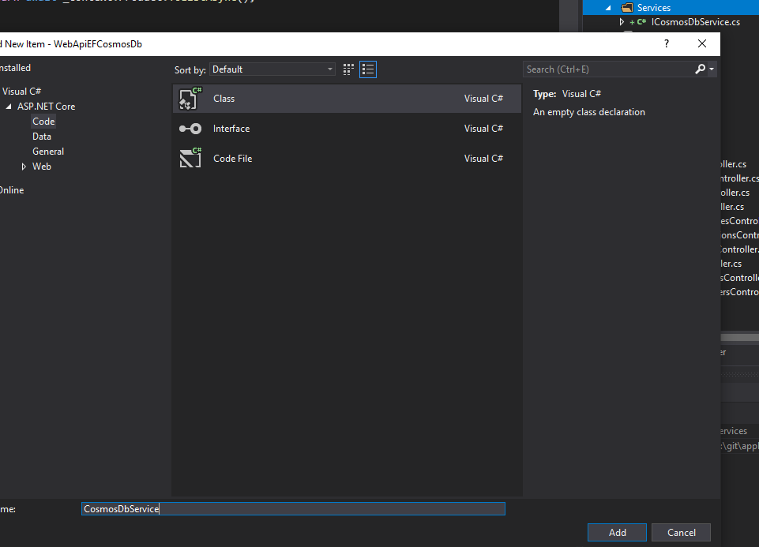

# ASP.NET Core WebApi and CosmosDB

>NOTE: Please first ensure you have completed [Lab 3](Lab3%20-%20WebApi%20SQL%20Server%20and%20EntityFramework.md)

## Create a project named WebApiEFCosmosDb

Use an ASP.NET Core Web Application with C#


> NOTE: Use the same solution created in [Lab 3](Lab3%20-%20WebApi%20SQL%20Server%20and%20EntityFramework.md)

## Install nuget packages

Install nuget packages:

- Microsoft.EntityFrameworkCore.Cosmos
- Newtonsoft.json

## Add CosmosDB account information _appsettings.json_

Please use the credentials created in [Lab 2](Lab2%20-%20Create%20infrastructure.ipynb)

```json
  "CosmosDb": {
    "Endpoint": "<URI IN THE KEYS SECTION>",
    "Key": "<PRIMARY OR SECONDARY KEY IN THE KEYS SECTION>",
    "DatabaseName": "<NAME OF THE DATABASE>",
    "ContainerName": "<NAME OF THE CONTAINER>"
  },
```

## Create Model

We are going to use the classes from the previous demos

1. Create "Models" folder
2. Copy-Paste the Model classes created in [Lab 3](Lab3%20-%20WebApi%20SQL%20Server%20and%20EntityFramework.md) 


> **NOTE**: We are going to work only with **ProductModel.cs**, so you don´t need to add all classes

3. Edit the files and update the namespace acordingly. In this case:

```csharp
namespace WebApiEFCosmosDb.Models
```


## Create DbContext

1. Create new folder named "Services"

1. Create a new interface for the cosmosdb context


1. Add the following methods to the interface

```csharp
public interface ICosmosDbService
{
    Task PostProduct(Product product);
    Task DeleteProduct(int id);
    bool ProductExists(int id);
    Task<ActionResult<Product>> GetProduct(int id);
    Task<ActionResult<IEnumerable<Product>>> GetProducts(string queryString);
}
```
>**NOTE**: We are not going to add all the CRUD operations this time

1. Add the CosmosDbService



## Initialize methods

Go to Startup.cs and Add the cosmos initialization method

```csharp
/// <summary>
/// Creates a Cosmos DB database and a container with the specified partition key. 
/// </summary>
/// <returns></returns>
private static async Task<CosmosDbService> InitializeCosmosClientInstanceAsync(IConfigurationSection configurationSection)
{
    string databaseName = configurationSection.GetSection("DatabaseName").Value;
    string containerName = configurationSection.GetSection("ContainerName").Value;
    string account = configurationSection.GetSection("Endpoint").Value;
    string key = configurationSection.GetSection("Key").Value;
    CosmosClientBuilder clientBuilder = new CosmosClientBuilder(account, key);
    CosmosClient client = clientBuilder
                        .WithConnectionModeDirect()
                        .Build();
    CosmosDbService cosmosDbService = new CosmosDbService(client, databaseName, containerName);
    DatabaseResponse database = await client.CreateDatabaseIfNotExistsAsync(databaseName);
    await database.Database.CreateContainerIfNotExistsAsync(containerName, "/productid");
    return cosmosDbService;
}
```

And also the following line in the ConfigureServices method

```csharp
public void ConfigureServices(IServiceCollection services)
{
    services.AddControllers();

    //Add the following line
    services.AddSingleton<ICosmosDbService>(InitializeCosmosClientInstanceAsync(Configuration.GetSection("CosmosDb")).GetAwaiter().GetResult());
}
```

>__NOTE:__ Now, EFCore is linked to cosmosdb

## Add the ProductController class

Now it´s time to create our controller. We need to do it manually, since EFCore at the time of writing this demo does not automatically generates the CRUD for us.

1. Create a new class
   


And implement some methods. At least, try to implement methods to Write data into the CosmosDB and to extract data from CosmosdDB

take a look for example to the methods 

```csharp
[Route("api/[controller]")]
[ApiController]
public class ProductsController: ControllerBase
{
    private readonly ICosmosDbService _context;

    public ProductsController(ICosmosDbService cosmosDbService)
    {
        _context = cosmosDbService;
    }

    // GET: api/Products
    [HttpGet]
    public async Task<ActionResult<IEnumerable<Product>>> GetProducts()
    {
        string queryString = "select * from c";
        return await _context.GetProducts(queryString);
    }

    // GET: api/Products/5
    [HttpGet("{id}")]
    public async Task<ActionResult<Product>> GetProduct(int id)
    {
        var product = await _context.GetProduct(id);

        if (product == null)
        {
            throw new NotImplementedException();
        }

        return product;
    }

    // POST: api/products/postproduct
    // To protect from overposting attacks, please enable the specific properties you want to bind to, for
    // more details see https://aka.ms/RazorPagesCRUD.
    [Route("postproduct")]
    [HttpPost]
    public async Task PostProduct(Product product)
    {
        try
        {
            await _context.PostProduct(product);
        }
        catch (Exception e)
        { throw e; }
    }

    // DELETE: api/products/deleteproducts/5
    [HttpDelete("deleteproduct/{id}")]
    public async Task DeleteProduct(int id)
    {
        await _context.DeleteProduct(id);            
    }

    
}
```
## Prepare serialization

We are going to use __*productid*__ as the partition key for our container. "ProductId", is integer, but CosmosDB requires to be "string", so we need to create a converter to transform the column automatically from integer to string.

Please, create a new class named _JsonToStringConverter.cs_ 

```csharp
public class JsonToStringConverter : JsonConverter
{
    public override bool CanConvert(Type objectType)
    {
        return true;
    }

    public override void WriteJson(JsonWriter writer, object value, JsonSerializer serializer)
    {
        writer.WriteValue(value.ToString());
    }

    public override bool CanRead
    {
        get { return false; }
    }

    public override object ReadJson(JsonReader reader, Type objectType, object existingValue, JsonSerializer serializer)
    {
        throw new NotImplementedException();
    }
}
```

## Configure serialization of Product.cs

Since we are going to work with the class _Products.cs_, we must prepare the class to json serialization with some "changes":

- ProductId will be mapped as "id"
- We are not going to update ThumNailPhoto char array data to our JSON

Edit the class [Product.cs](../ApplicationInsightsFullDemo/WebApiEFCosmosDb/Models/Product.cs)

```csharp
[JsonConverter(typeof(JsonToStringConverter))]
[JsonProperty(PropertyName = "id")]
public int ProductId { get; set; }

//Ignore thumbnails
[JsonIgnore]
public byte[] ThumbNailPhoto { get; set; }
```

# Deploy

Time to build and deploy the web app


# Test

Since we still don´t have data in cosmosdb, this result is expected


>Note: navigate to /api/products