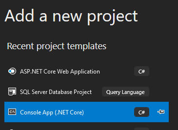

# Console app for testing

>NOTE: Please first ensure you have completed [Lab 4](Lab4%20-%20ASP.NET%20netCore%203.0%20WebApi%20CosmosDB.md)

## Create the console application



Please, use "_ConsoleInterface_" as the name of our project

# NuGet packages

Add the following NuGet packages to our solution

- Microsoft.AspNet.WebApi.Client
- Newtonsoft.json
- Microsoft.Extensions.Configuration
- Microsoft.Extensions.Configuration.FileExtensions
- Microsoft.Extensions.Configuration.Json


## Add appsettings.json

Create the file _appsettings.json_ and add the following contents

```json
{
  "UrlApiSqlServer": "https://mslearn-appinsigts-sqlserver.azurewebsites.net",
  "UrlApiCosmos": "https://mslearn-appinsights-cosmosdb.azurewebsites.net",
  "Logging": {
    "LogLevel": {
      "Default": "Warning"
    }
  }
}
```

>_**NOTE:**_ Please, remember to update the URLs acordingly to your Web Apps

## Load configuration
Add the following code to the _static void Main(string[] args)_ to be able to read the configuration file

```csharp
#if DEBUG
    var builder = new ConfigurationBuilder()
        .SetBasePath(Directory.GetCurrentDirectory())
        .AddJsonFile("appsettings.debug.json", optional: true, reloadOnChange: true);
#else
    var builder = new ConfigurationBuilder()
        .SetBasePath(Directory.GetCurrentDirectory())
        .AddJsonFile("appsettings.json", optional: true, reloadOnChange: true);
#endif
```
>NOTE: With this strategy, you can have a sepecial json configuration file to use with debuggin in your environment

## Set variables

```csharp

IConfigurationRoot configuration = builder.Build();

_urlApiSqlServer = configuration.GetSection("UrlApiSqlServer").Value;
_urlApiCosmos = configuration.GetSection("UrlApiCosmos").Value;

...
```

# Initialize CosmosDB

Add the following method to _Program.cs_

```csharp
private static async void InitializeCosmosDB()
{
  /// Get the products
  var products = GetProducts();
  foreach (var item in products.Result)
  {
      Console.WriteLine(String.Format("Readed from SQL Server: ProductId {0} - {1}", item.ProductId, item.Name));

      await InsertProductInCosmosDb(item);

      Console.WriteLine("Inserted Product in CosmosDB");
  }
}
```

# Add the ApiCalls required to work

Add the following code to the Program.cs

```csharp
#region ApiCalls

private static async Task<List<Product>> GetProducts()
{
    var users = new List<Product>();

    using (HttpClient client = new HttpClient())
    {
        client.BaseAddress = new Uri(_urlApiSqlServer);
        client.DefaultRequestHeaders.Accept.Clear();
        client.DefaultRequestHeaders.Accept.Add(new System.Net.Http.Headers.MediaTypeWithQualityHeaderValue("application/json"));

        HttpResponseMessage response = await client.GetAsync("api/products");
        response.EnsureSuccessStatusCode();
        if (response.IsSuccessStatusCode)
        {
            users = await response.Content.ReadAsAsync<List<Product>>();
        }
    }

    return users;
}

private static async Task<Product> InsertProductInCosmosDb(Product product)
{
    try
    {
        using (HttpClient client = new HttpClient())
        {
            client.BaseAddress = new Uri(_urlApiCosmos);
            client.DefaultRequestHeaders.Accept.Clear();
            client.DefaultRequestHeaders.Accept.Add(new System.Net.Http.Headers.MediaTypeWithQualityHeaderValue("application/json"));

            HttpResponseMessage response = await client.PostAsJsonAsync("api/products/postproduct/", product);
            response.EnsureSuccessStatusCode();
            if (response.IsSuccessStatusCode)
            {
                product = await response.Content.ReadAsAsync<Product>();
            }
        }

        return product;
    }
    catch(Exception e)
    {
        throw e;
    }
}
#endregion ApiCalls
```

# Execute the ConsoleInterface

Execute in debug mode


>NOTE: You should see how the tool is getting data from SQL Server and storing that data in CosmosDB