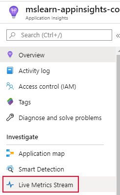
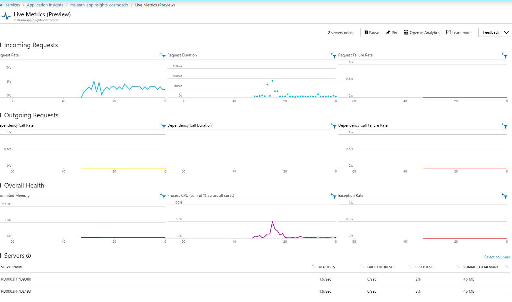
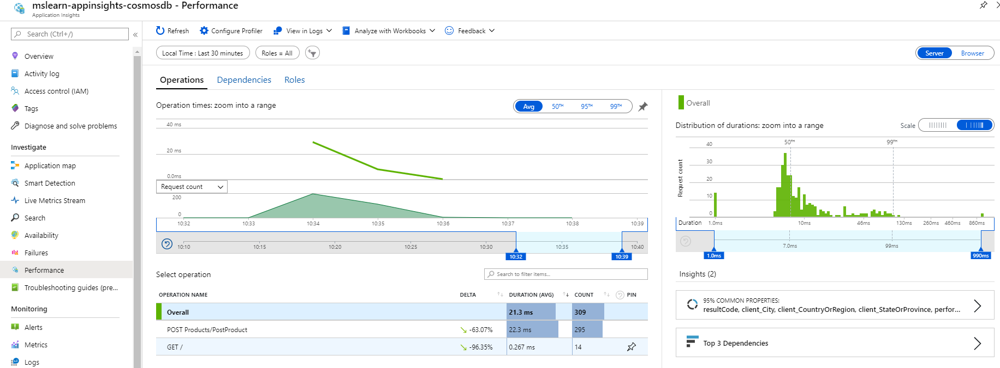
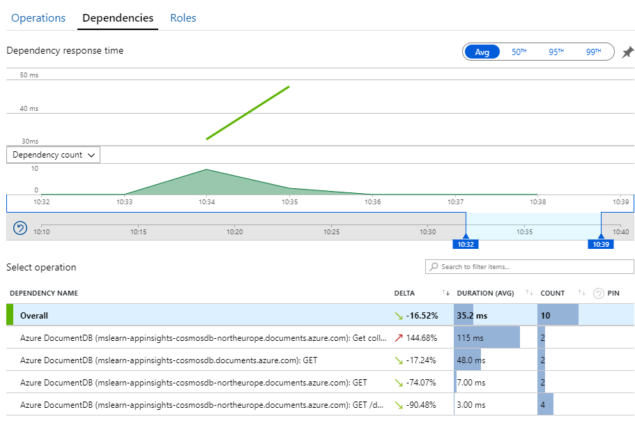
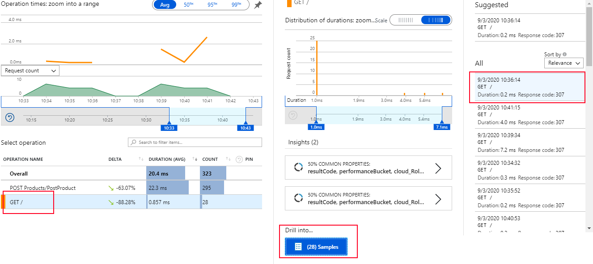
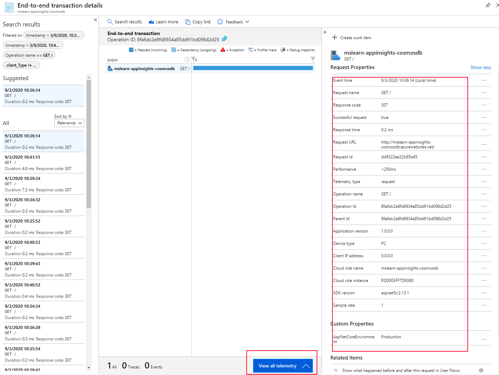
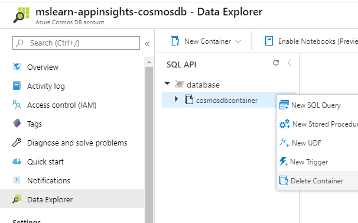

# Review telemetry

Now that you ended [Lab 6](Lab6%20-%20Add%20application%20insights.md), you have basic telemetry for your solution.

Go and execute again the _consoleinterface.exe_ compiled in **release**

> NOTE: Since the demo code is not prepared to have data in cosmosdb with the first run, [**please, drop and create the cosmosdb collection**](#how-to-delete-a-container)

The first execution contains the initialization methods. It takes 1m more or less and its nice to see how it´s working by going to the "_Live Metrics_" pannel in the "Live Metrics Stream" section of your application insights

## Check the data

Go to "_performance_" section to review the data you have at this point

As you can see, we don´t have too much data to analyze. Please play a little bit with the data you have. Pay attention that at this point, you only have data related with CosmosDB calls

Let´s see which information i have from each call

As you can see, we have some information, but not as useful as it could be

# Add relevant information to our tools

Let´s continue with the next lab

# Appendix 
## How to delete a container

