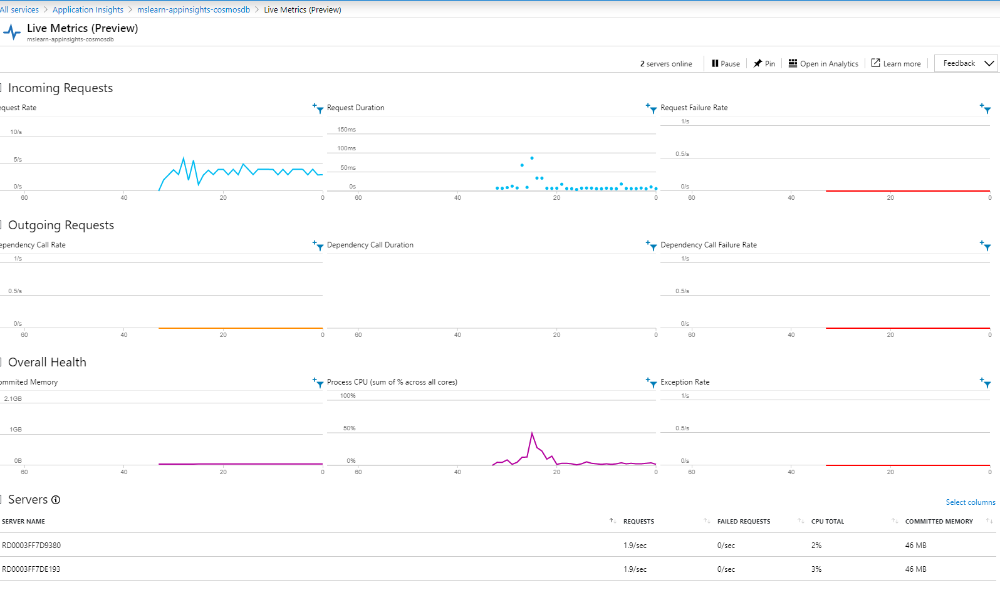
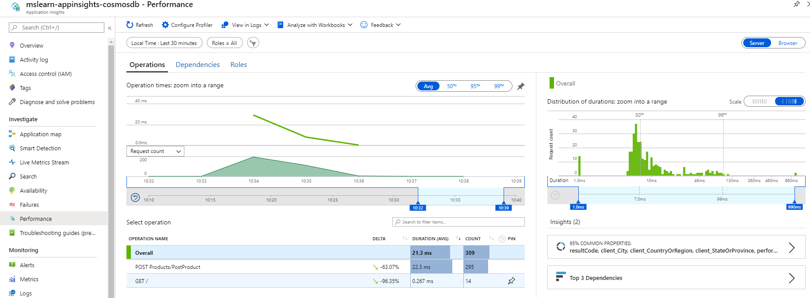
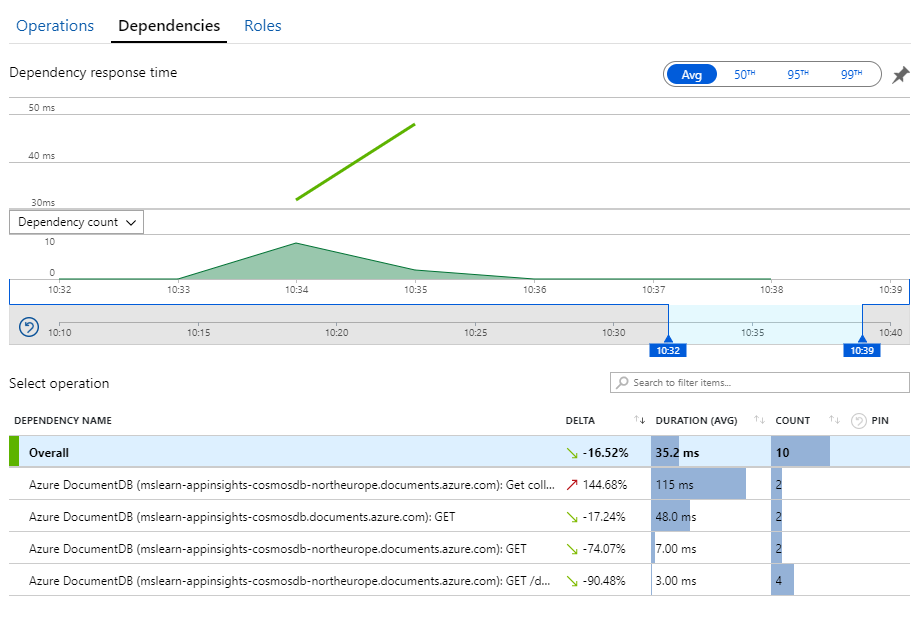

# Review telemetry

At this point, we configured our basic telemetry for application insights.

Go and execute the _consoleinterface.exe_ compiled in **release**

The first execution contains the initialization methods. It takes 1m more or less and its nice to see how it´s working by going to the "_Live Metrics_" pannel in the "Live Metrics Stream" section of your application insights

## Check the data

Go to "_performance_" section to review the data you have at this point

As you can see, we don´t have too much data to analyze. Please play a little bit with the data you have. Pay attention that at this point, you only have data related with CosmosDB calls

