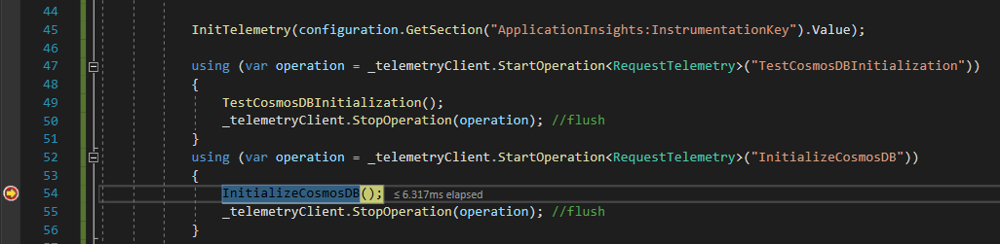
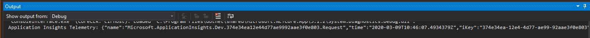
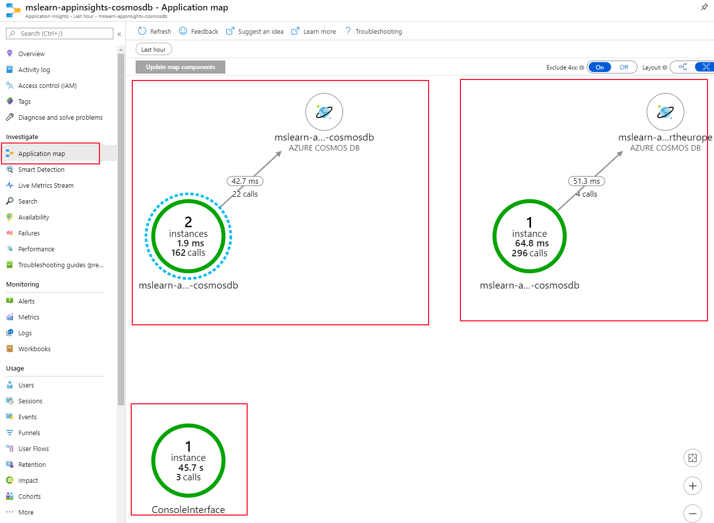
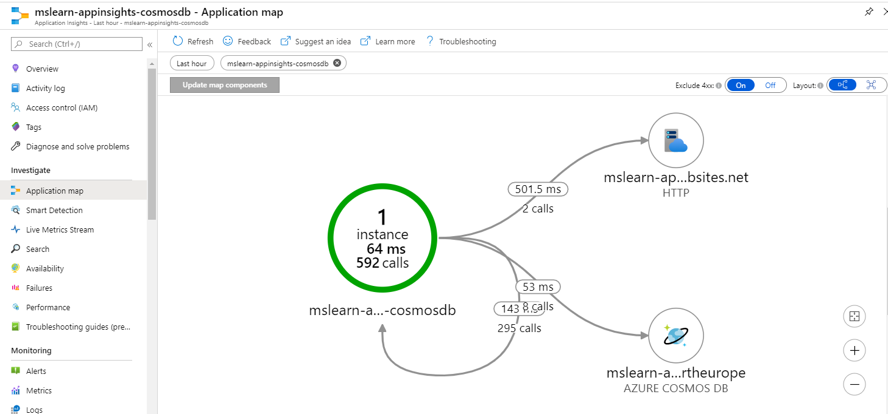
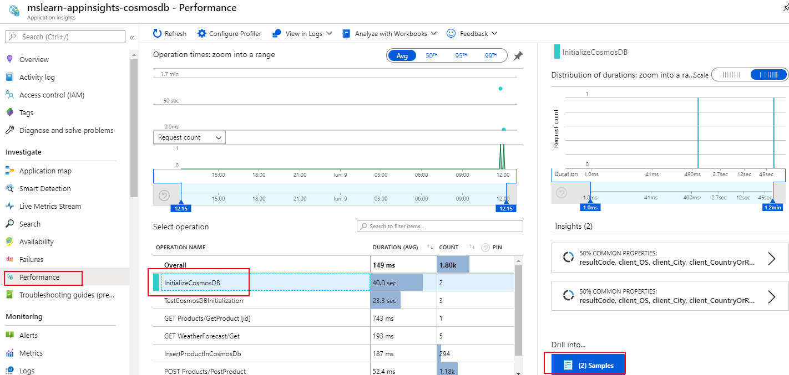
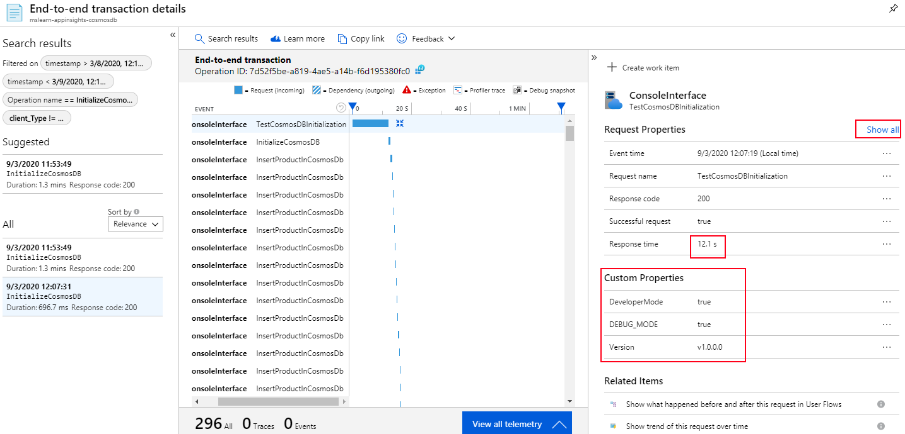

# Review telemetry demo 2

In this demo, we are going to add useful information to our tools

> NOTE: Since the demo code is not prepared to have data in cosmosdb with the first run, **please, drop and create the cosmosdb collection**


# ConsoleInterface configuration

## Create your own TelemetryClient

Add this on the ConsoleInterface 
```csharp
public static TelemetryClient _telemetryClient = new TelemetryClient();

public static void InitTelemetry(string key)
{            
    TelemetryConfiguration.Active.InstrumentationKey = key;

    _telemetryClient.InstrumentationKey = key;
    _telemetryClient.Context.User.Id = Environment.UserName;
    _telemetryClient.Context.Operation.Id = Guid.NewGuid().ToString();
    _telemetryClient.Context.Device.OperatingSystem = Environment.OSVersion.ToString();
    _telemetryClient.Context.Cloud.RoleName = "ConsoleInterface";


    /// Custom properites
    var properties = new Dictionary<string, string>
    {
#if DEBUG
        {"DEBUG_MODE",   "true"},
#endif
        {"Version", String.Format("v{0} ", typeof(ConsoleInterface.Program).Assembly.GetName().Version) }
    };
    foreach (var p in properties)
    {
        if (!_telemetryClient.Context.Properties.ContainsKey(p.Key))
            _telemetryClient.Context.Properties.Add(p);
    }
#if DEBUG
    // Telemetry results exposed inmediately 
    // Switch it off in production, because it may slow down your app.
    TelemetryConfiguration.Active.TelemetryChannel.DeveloperMode = true;
#endif
}
```

And call the method with

```csharp
InitTelemetry(configuration.GetSection("ApplicationInsights:InstrumentationKey").Value);
```

## Create your own operator encapsulator

To enhance data comming from ApplicationInsights, it´s good to add your own interesting data thread to the stack

```csharp
using (var operation = _telemetryClient.StartOperation<RequestTelemetry>("TestCosmosDBInitialization"))
{
    //This is your method
    TestCosmosDBInitialization();
    _telemetryClient.StopOperation(operation); //flush
}
using (var operation = _telemetryClient.StartOperation<RequestTelemetry>("InitializeCosmosDB"))
{
    //This is your method
    InitializeCosmosDB();
    _telemetryClient.StopOperation(operation); //flush
}
```

## Execute in debug mode

Put a breakpoint for example here



Now, you should see that the call has been executed, and contains all the data you configured



Now, go to _ApplicationInsights -> Application map_



>NOTE: ConsoleInterface is separated from the other calls, despite it´s part of your entire solution

# Add dependency tracking

Our ConsoleInterface is separated from the webapis, so we can´t see the real execution flow. Let´s enhance our telemetry solution

## Configure ConsoleInterface

```csharp
DependencyTrackingTelemetryModule depModule = new DependencyTrackingTelemetryModule();
    depModule.Initialize(TelemetryConfiguration.Active);
```

And now, we are able to track dependency calls to external sources, by encapsulating our calls inside this code:

```csharp
var startTime = DateTime.UtcNow;
var timer = System.Diagnostics.Stopwatch.StartNew();
try
{
    // making dependency call
    success = dependency.Call();
}
finally
{
    timer.Stop();
    telemetryClient.TrackDependency("myDependencyType", "myDependencyCall", "myDependencyData",  startTime, timer.Elapsed, success);
}
```

>NOTE: For more information
> - https://docs.microsoft.com/en-us/azure/azure-monitor/app/asp-net-dependencies
> - https://docs.microsoft.com/en-us/azure/azure-monitor/app/auto-collect-dependencies


If you repeat the execution of the ConsoleInterface, this time you will see something like this



And if you go to _ApplicationInsights -> Performance_ section:



This time, you will see more valuable information



>NOTE: Dependency execution calls, time of execution,...


## WebApi configuration

## Create a new initializer
Create the following class to rename the cloudname used "_CloudRoleNameTelemetryInitializer_"

```csharp
using Microsoft.ApplicationInsights.Channel;
using Microsoft.ApplicationInsights.Extensibility;

namespace YOUR_NAMESPACE
{
    public class CloudRoleNameTelemetryInitializer : ITelemetryInitializer
    {
        public void Initialize(ITelemetry telemetry)
        {
            // set custom role name here
            telemetry.Context.Cloud.RoleName = "<cloud_name_you_want>";
        }
    }
}
```

And use "_WebApiSqlServer_"/"_WebApiCosmosDb_" depending on the WebApi you are configuring

## Use the new initializer

Add the following line in the _Start.cs_ class, method  _public void ConfigureServices(IServiceCollection services)_

```csharp
// The following line enables Application Insights telemetry collection.
services.AddApplicationInsightsTelemetry();

//Use our own initializer to set up the cloudrole name
services.AddSingleton<ITelemetryInitializer, CloudRoleNameTelemetryInitializer>();
```

## Enable DependencyTracking on WebApi

To enable dependencytracking on webapi, you only need to add this line to the _Startup.cs_ method _public void ConfigureServices(IServiceCollection services)_

```csharp
// The following configures DependencyTrackingTelemetryModule.
// Similarly, any other default modules can be configured.
services.ConfigureTelemetryModule<DependencyTrackingTelemetryModule>((module, o) =>
{
    module.EnableW3CHeadersInjection = true;
});
```

