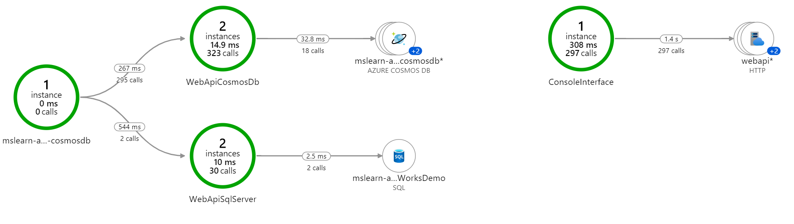

# application-insights-full-demo
Full demo to show complete application insights instrumentation

## Labs

1. Lab1 [ApplicationInsights](Labs/Lab1%20-%20AZ-203_05_lab.md)
   
   This exercise is based on one of the labs from the Exam [Az-203](https://github.com/MicrosoftLearning/AZ-203-DevelopingSolutionsforMicrosoftAzure)

1. [Lab2](Labs/Lab2%20-%20Create%20infrastructure.ipynb)
   
   Create infrastructure for the rest of the labs
   
2. [Lab 3](Labs/Lab3%20-%20WebApi%20SQL%20Server%20and%20EntityFramework.md)

    ASPNET netCore 3.0 WebApi with SQL Server and EntityFramework core

3. [Lab 4](Labs/Lab4%20-%20ASP.NET%20netCore%203.0%20WebApi%20CosmosDB.md)

    ASPNET netCore 3.0 WebApi with CosmosDB and Entity Framework core

4. [Lab 5](Labs/Lab5%20-%20ConsoleInterface.md)
    
    Create a console interface

1. [Lab 6](Labs/Lab6%20-%20Add%20application%20insights.md)

    Add application insights to the solution

1. [Lab 7](Labs/Lab7%20-%20Review%20data%20from%20application%20insights.md)

    Get data from application insights
   
2. [Lab 8](Labs/Lab8%20-%20Include%20extra%20information%20in%20application%20insights.md)

    Include extra data from application insights